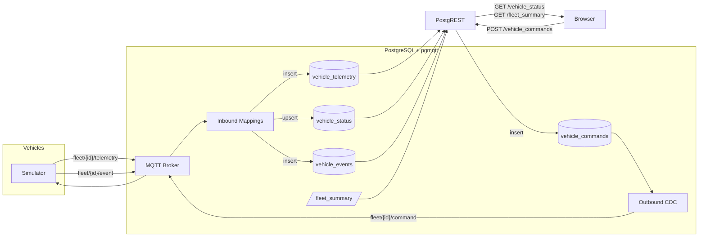

# Fleet Tracking Demo

Real-time fleet management with **zero application code** — every data path runs through PostgreSQL.

<video src="https://private-user-images.githubusercontent.com/17395710/567990016-ca624f4d-6c36-42e6-9901-31ccbc3a9174.mp4?jwt=eyJ0eXAiOiJKV1QiLCJhbGciOiJIUzI1NiJ9.eyJpc3MiOiJnaXRodWIuY29tIiwiYXVkIjoicmF3LmdpdGh1YnVzZXJjb250ZW50LmNvbSIsImtleSI6ImtleTUiLCJleHAiOjE3NzQzMDA3MDUsIm5iZiI6MTc3NDMwMDQwNSwicGF0aCI6Ii8xNzM5NTcxMC81Njc5OTAwMTYtY2E2MjRmNGQtNmMzNi00MmU2LTk5MDEtMzFjY2JjM2E5MTc0Lm1wND9YLUFtei1BbGdvcml0aG09QVdTNC1ITUFDLVNIQTI1NiZYLUFtei1DcmVkZW50aWFsPUFLSUFWQ09EWUxTQTUzUFFLNFpBJTJGMjAyNjAzMjMlMkZ1cy1lYXN0LTElMkZzMyUyRmF3czRfcmVxdWVzdCZYLUFtei1EYXRlPTIwMjYwMzIzVDIxMTMyNVomWC1BbXotRXhwaXJlcz0zMDAmWC1BbXotU2lnbmF0dXJlPTlhOGJkYzgwZWI0YmUyMzIwZjRiM2UzYWRhYzJlZWU4MzVmM2ZkNjgzMjdjY2RjYjAzZGYzZmMxZDRiNWI3YWEmWC1BbXotU2lnbmVkSGVhZGVycz1ob3N0In0.6LZZAyowhcGg9iaS9ki-wcTEU6t68nbrTEjoew1F5Qk" controls autoplay loop muted width="100%"></video>

## Architecture



Five simulated vehicles publish telemetry over MQTT. **pgmqtt** inbound mappings write every message to PostgreSQL — an append-only audit log and a device-twin upsert — with no application code in between. A Postgres view computes fleet-wide aggregates. **PostgREST** serves the tables and views as a REST API. Dispatch commands are inserted via POST, and **CDC** publishes them back to the target vehicle over MQTT.

## What it demonstrates

| Feature | How it's used |
|---|---|
| **Inbound mapping (insert)** | Every telemetry message → `vehicle_telemetry` audit log |
| **Inbound mapping (upsert)** | Latest reading per vehicle → `vehicle_status` device twin |
| **Inbound mapping (insert)** | Threshold events → `vehicle_events` |
| **Outbound mapping (CDC)** | Row inserted into `vehicle_commands` → published to `fleet/{id}/command` |
| **PostgREST** | Zero-code REST API over all tables and the `fleet_summary` view |
| **Postgres views** | `fleet_summary` computes live aggregates (avg speed, fuel, event counts) |

## Running

```bash
docker compose up -d
open http://localhost:5173
```

## Components

| Service | Role |
|---|---|
| `postgres` | PostgreSQL + pgmqtt (embedded MQTT broker, inbound/outbound mappings) |
| `postgrest` | Auto-generated REST API from Postgres schema |
| `simulator` | Pure MQTT client — publishes telemetry, receives commands |
| `frontend` | Vite + Leaflet + Chart.js dashboard |
