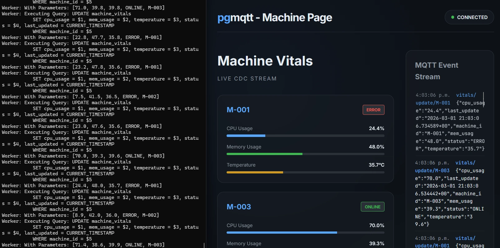
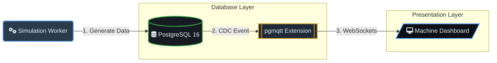

# pgmqtt - Machine Page Demo

A demonstration of `pgmqtt`, a PostgreSQL extension that embeds an MQTT 5.0 broker directly inside the database.



## Architecture



## Overview
This project simulates an IIoT/Machine Monitoring environment. A background worker generates mock telemetry data in PostgreSQL, which is then automatically published to MQTT topics via `pgmqtt`'s Change Data Capture (CDC). The web dashboard receives these updates live over WebSockets directly from the database.

## Setup

```bash
cd demos/machinepage
docker-compose up -d
```

open [http://localhost:5173](http://localhost:5173)