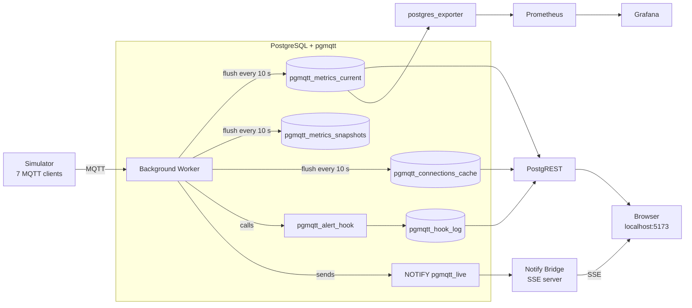

# pgmqtt Observability Demo

Four production-ready patterns for consuming broker metrics, all driven by the same counter pipeline inside PostgreSQL.

<video src="https://private-user-images.githubusercontent.com/17395710/577092935-eb576e6e-bdfc-4fd7-981e-22870b86adf8.mp4?jwt=eyJ0eXAiOiJKV1QiLCJhbGciOiJIUzI1NiJ9.eyJpc3MiOiJnaXRodWIuY29tIiwiYXVkIjoicmF3LmdpdGh1YnVzZXJjb250ZW50LmNvbSIsImtleSI6ImtleTUiLCJleHAiOjE3NzYwMjA0ODQsIm5iZiI6MTc3NjAyMDE4NCwicGF0aCI6Ii8xNzM5NTcxMC81NzcwOTI5MzUtZWI1NzZlNmUtYmRmYy00ZmQ3LTk4MWUtMjI4NzBiODZhZGY4Lm1wND9YLUFtei1BbGdvcml0aG09QVdTNC1ITUFDLVNIQTI1NiZYLUFtei1DcmVkZW50aWFsPUFLSUFWQ09EWUxTQTUzUFFLNFpBJTJGMjAyNjA0MTIlMkZ1cy1lYXN0LTElMkZzMyUyRmF3czRfcmVxdWVzdCZYLUFtei1EYXRlPTIwMjYwNDEyVDE4NTYyNFomWC1BbXotRXhwaXJlcz0zMDAmWC1BbXotU2lnbmF0dXJlPTA3ZDNmZDk0N2JmNjM2ZmY2NWNmMjg4NTgyZDdlYjM1ZmYzOWMwYjRlMTljYmE0MWNlYmE1NWQ3YzllOTRhYWMmWC1BbXotU2lnbmVkSGVhZGVycz1ob3N0JnJlc3BvbnNlLWNvbnRlbnQtdHlwZT12aWRlbyUyRm1wNCJ9.5zMFNbNp5fQhIj5sFSrY0ZIe8HjSPVX-ssVr9KqTTQs" controls autoplay loop muted width="100%"></video>

## Architecture



## Observability Scenarios

| Tab | Pattern | How it works |
|-----|---------|-------------|
| **SQL Polling** | `SELECT * FROM pgmqtt_metrics()` via PostgREST | Browser polls every 5 s; shows live counter table and stat cards |
| **Connections** | `SELECT * FROM pgmqtt_connections()` via PostgREST | Per-client view: transport, uptime, message counts, queue depth |
| **Live Stream** | `LISTEN pgmqtt_live` → SSE → `EventSource` | Every flush fires a NOTIFY with a JSON snapshot; bridge forwards to browser with no polling |
| **Hook Log** | `pgmqtt.metrics_hook_function = 'public.pgmqtt_alert_hook'` | SQL function called on each flush; writes payload + alert flag to `pgmqtt_hook_log` |
| **Grafana** | postgres_exporter → Prometheus → provisioned dashboard | Full time-series graphs of every counter, auto-refreshing at 10 s |

## Running

Provide your enterprise license key, then start:

```bash
echo "PGMQTT_LICENSE_KEY=<your-key>" > .env
docker compose up -d
```

> The license key must be in `.env` (not just exported) because docker compose
> passes it as a postgres command-line GUC, which takes priority over
> `ALTER SYSTEM SET`.

Open **http://localhost:5173** for the interactive demo dashboard.

Open **http://localhost:3002** to go directly to Grafana.

## Services

| Service | Port | Role |
|---------|------|------|
| `postgres` | 5432, 1883 | PostgreSQL + pgmqtt broker |
| `simulator` | — | 7 MQTT clients generating traffic |
| `postgrest` | 3000 | REST API over metrics tables/functions |
| `notify-bridge` | 3001 | SSE server bridging NOTIFY → browser |
| `postgres-exporter` | 9187 | Scrapes `pgmqtt_metrics()` for Prometheus |
| `prometheus` | 9090 | Stores time-series metric data |
| `grafana` | 3002 | Visualises Prometheus data (anonymous access, pre-provisioned dashboard) |
| `frontend` | 5173 | Vite dev server — the demo UI |
