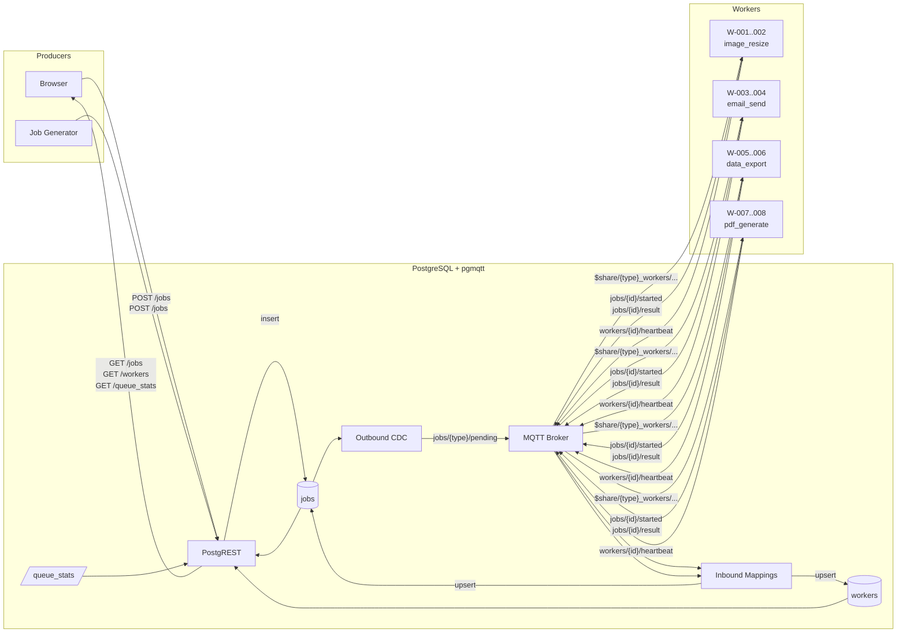

# Queue Demo

Distributed job queue with **zero application code** — PostgreSQL rows are the queue, MQTT is the transport.

<video src="https://private-user-images.githubusercontent.com/17395710/568009762-5d2bb2b3-20b0-4f0e-98eb-fbcd7e4c4ffc.mp4?jwt=eyJ0eXAiOiJKV1QiLCJhbGciOiJIUzI1NiJ9.eyJpc3MiOiJnaXRodWIuY29tIiwiYXVkIjoicmF3LmdpdGh1YnVzZXJjb250ZW50LmNvbSIsImtleSI6ImtleTUiLCJleHAiOjE3NzQzMDQxOTEsIm5iZiI6MTc3NDMwMzg5MSwicGF0aCI6Ii8xNzM5NTcxMC81NjgwMDk3NjItNWQyYmIyYjMtMjBiMC00ZjBlLTk4ZWItZmJjZDdlNGM0ZmZjLm1wND9YLUFtei1BbGdvcml0aG09QVdTNC1ITUFDLVNIQTI1NiZYLUFtei1DcmVkZW50aWFsPUFLSUFWQ09EWUxTQTUzUFFLNFpBJTJGMjAyNjAzMjMlMkZ1cy1lYXN0LTElMkZzMyUyRmF3czRfcmVxdWVzdCZYLUFtei1EYXRlPTIwMjYwMzIzVDIyMTEzMVomWC1BbXotRXhwaXJlcz0zMDAmWC1BbXotU2lnbmF0dXJlPTE2NjYzNmVlODhmZTZjMjhhODMyMDQwNzFkODg5Njg4MDZjZGIxZWU2ZTEyZGRhODU2OWVlZDE3NTc2MzU5MTgmWC1BbXotU2lnbmVkSGVhZGVycz1ob3N0In0.OwicuM1hYlpySTxNK_uB5JdeiYQxcHD0VRqeJy_p-h0" controls autoplay loop muted width="100%"></video>

## Architecture



Jobs are **POST**ed via REST and stored as rows in the `jobs` table. **pgmqtt** outbound CDC publishes each new row to `jobs/{type}/pending`. Each worker is an independent process that joins a shared subscription group (`$share/{type}_workers/jobs/{type}/pending`) — the broker round-robins each job to exactly one worker per type. When a worker receives a job it immediately unsubscribes, processes the job, then resubscribes; this signals to the broker that it is unavailable, so in-flight jobs are never routed to a busy worker. Workers report results back over MQTT, and **inbound mappings** upsert the status updates back into the same row. Worker heartbeats maintain a device-twin `workers` table. No Redis, no RabbitMQ, no application server.

## What it demonstrates

| Feature | How it's used |
|---|---|
| **Outbound mapping (CDC)** | New job row → published to `jobs/{type}/pending` |
| **Inbound mapping (upsert)** | `jobs/{id}/started` → updates job status to running |
| **Inbound mapping (upsert)** | `jobs/{id}/result` → updates job status to completed/failed |
| **Inbound mapping (upsert)** | `workers/{id}/heartbeat` → device-twin in `workers` table |
| **PostgREST** | Zero-code REST API for submitting jobs + serving dashboard data |
| **Postgres views** | `queue_stats` computes live throughput, latency, and success rate |
| **Shared subscriptions** | `$share/{type}_workers/...` — broker-native round-robin, no app-level routing |

## Running

```bash
docker compose up -d
open http://localhost:5173
```

## Components

| Service | Role |
|---|---|
| `postgres` | PostgreSQL + pgmqtt (embedded MQTT broker, inbound/outbound mappings) |
| `postgrest` | Auto-generated REST API from Postgres schema |
| `generator` | Submits jobs in a loop via PostgREST |
| `image-resize-{1,2}` | Workers for `image_resize` jobs — each an independent MQTT client |
| `email-send-{1,2}` | Workers for `email_send` jobs |
| `data-export-{1,2}` | Workers for `data_export` jobs |
| `pdf-generate-{1,2}` | Workers for `pdf_generate` jobs |
| `frontend` | Vite + Chart.js dashboard with live MQTT feed |
